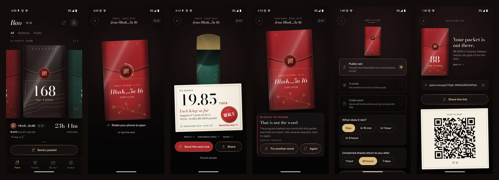
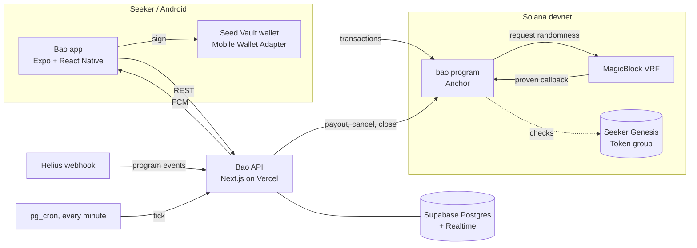

# Bao 紅包

**Red packets for Seeker. One Seeker, one grab.**

Drop a red packet of SKR into your circle or the open feed. Everyone gets a push, shakes their phone,
and grabs a share. Lucky packets split at random with verifiable on-chain randomness; the biggest grab is
crowned Luck King and, by custom, sends the next one.

Every crypto giveaway gets farmed by bots. Bao's can't be: each grab is bound on-chain to the phone's
**Seeker Genesis Token**, so one device grabs once, no matter how many wallets it has. A farm of
emulators is refused by the program itself, not by a server.



**[Watch the three-minute demo](https://youtu.be/N1hNVH_5Gmo)** · [Get the APK](https://github.com/RaYYeR220/bao/releases/latest) · [Review it in five minutes](JUDGES.md) · [Pitch deck](https://getbao.vercel.app/bao-deck.pdf)

> Live on **Solana devnet** (`DifXuyhEu3r7sgXQjgCokyikQFcYCYD2cwhjNyU7j6XR`). Mainnet follows the dApp Store
> release. Every claim below links to a transaction in [PROOF.md](PROOF.md).

## How a packet works

1. **Drop.** The sender chooses an amount, a number of shares, Lucky or Equal, and an audience: a circle,
   the open feed (Seeker-only), or a code word. One Seed Vault signature moves the tokens into a vault owned
   by the packet and pre-funds a gas tank, so grabbers only ever pay the network fee.
2. **Grab.** Shake three times. The program checks the Genesis Token, records the grab under the token's
   mint (not the wallet), and reserves a share.
3. **Reveal.** Lucky packets request MagicBlock VRF; about two seconds later a proven random value assigns
   the share with WeChat's double-mean split. Equal packets pay instantly.
4. **Luck King.** When the last share is assigned, the biggest grab receives a Crown. Only the Crown holder
   can drop the next packet in the chain.
5. **Close.** A crank pays out won shares, cancels requests the oracle never answered, and closes expired
   packets, returning what is left to the sender.

## Why it only makes sense on a Seeker

- **Seeker Genesis Token** is the sybil filter, checked on-chain.
- **Seed Vault** signs every grab with a biometric, inside the Mobile Wallet Adapter flow.
- **Shake, haptics, sound**: opening a packet is a physical gesture.
- **NFC tags and QR codes** hand out packets in person; **push** and a **home-screen widget** bring you back
  when a packet lands in your circle or a rain is about to start.
- **`.skr` names** are the social handles throughout.

## Architecture



The app reads the chain directly when the API is unreachable: grabbing, dropping and the feed keep working.

## Repository

| Path | What |
|---|---|
| `programs/bao` | The Anchor program and its LiteSVM test suite (76 tests) |
| `packages/sdk` | TypeScript client generated with Codama, plus share math, circle Merkle trees, transaction builders and the API contract |
| `apps/mobile` | The Android app (Expo SDK 57, React Native 0.86, Mobile Wallet Adapter, Skia, Reanimated) |
| `apps/web` | API, crank, indexer, push, Solana Actions and link pages (Next.js on Vercel, Supabase) |
| `scripts/devnet` | Devnet setup and an end-to-end smoke test against the real VRF |
| `supabase` | Database migrations |

## Try it

- Install the APK from the latest [release](../../releases) on any Android phone or emulator with a Solana
  wallet (on a Seeker, the built-in Seed Vault wallet).
- On devnet, the **Playground** button in the app gives you test SOL, tSKR (devnet SKR) and a test Genesis
  Token, so you can grab without a Seeker.

## Build from source

```bash
# program + tests
anchor build && cargo test -p bao

# sdk and api
pnpm install
pnpm --filter @bao/sdk test
pnpm --filter web test

# end-to-end on devnet with the real VRF
pnpm --filter @bao/devnet-scripts smoke

# android app (needs Android SDK, a device or emulator, and a Mobile Wallet Adapter wallet)
cd apps/mobile && npm install && npx expo run:android
```

Environment variables for the API are listed in [`apps/web/README.md`](apps/web/README.md).

## Security

See [THREAT_MODEL.md](THREAT_MODEL.md): device binding, randomness, the griefing attacks that were closed
(with the tests that prove it), and what Bao does not claim.

## What is in this build

Nothing in the submitted APK is mocked. Each feature is either working, working on devnet only, or planned.

| Feature | Status |
|---|---|
| Drop, grab, payout, refund (Anchor program) | Working on devnet |
| One grab per Seeker Genesis Token (`NotASeeker` 6013, `AlreadyGrabbedOnThisDevice` 6016) | Working on devnet against a test group; the real mainnet token layout passes the same check in a test |
| Verifiable randomness per grab (MagicBlock VRF) | Working on devnet |
| Wallet connect, Sign In With Solana and signing over Mobile Wallet Adapter | Working; tested with Phantom on a Samsung Galaxy A52 and with a test wallet, not yet on a Seeker |
| Shake to open, haptics, sound, home-screen widget, push, QR scanner, App Links | Working |
| Circles, invite codes, Luck King chains, leaderboards, scheduled rains | Working |
| House rain (the crank keeps a few public packets live) | Working on devnet |
| Solana Actions (grab, create) | Working on devnet |
| Writing a packet to an NFC tag | Built; not tried on a physical tag |
| SKR | tSKR stand-in on devnet; real SKR on mainnet is planned |
| Mainnet deployment, dApp Store release, multisig upgrade authority | Planned |

On devnet so far: 37 packets, 32 grabs, 30 randomness proofs and 26 payouts, 344 of 1,701 tSKR grabbed. These
are the builder's own test runs on one phone, one emulator and scripted wallets; there are no outside users yet.

## Honest limits

- **Devnet only, for now.** The deployed program checks a devnet test group that anyone can join through the
  faucet. The same check is proven against a real mainnet Seeker Genesis Token in
  `programs/bao/tests/test_mainnet_genesis.rs`.
- **SKR on devnet is tSKR**, a stand-in mint with the same decimals; on mainnet packets hold real SKR.
- **The program is upgradeable** until the mainnet release.
- **The VRF oracle is trusted for liveness, not for fairness**: a missing answer leads to a refund path,
  never to an unproven payout.
- **Tested on a Samsung Galaxy A52 with Phantom and on an emulator with a test wallet, not on a Seeker.** There
  was no Seeker at hand, so Seed Vault itself is exercised only through the Mobile Wallet Adapter protocol it
  shares with those wallets.
- **Writing a packet to an NFC tag is implemented but was not tried on a physical tag.** Opening a packet from
  a link, a QR code or a tag that carries the link uses the same App Link.
- **The app sends tSKR only.** The program accepts any classic SPL mint and Token-2022 mints without the
  extensions listed in the threat model; a token picker is not in this build.

## License

MIT
